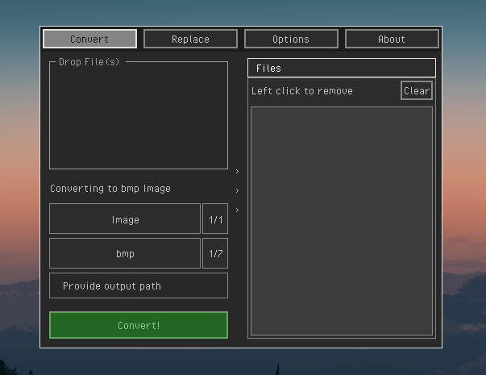
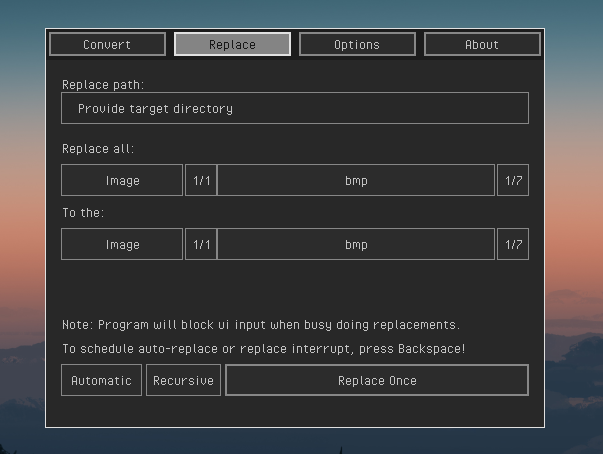
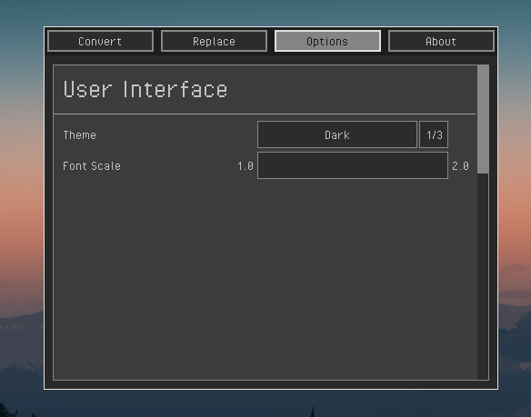
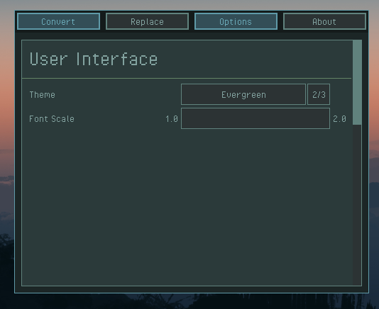
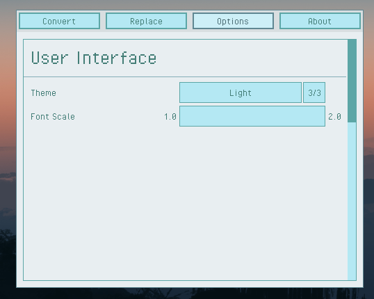

# DEMCO

DEsktop Media COnverter (Demco) - simple gui program that act as a wrapper for ffmpeg, used to convert
common file types from one - into another.

This software may change at ANY time, so if you are one of 2 people using this program, consider checking
the branches for older builds if you need them.

I may rework the program entirely later to introduce multi-threading and non blocking user interface.
Also i may redo the User Interface, since i already found out a better way of doing it.

## Contribution
If you happen to use this... and like it!? Please.. submit issues or feature requests if you have some good one.
I may not add them at first, but the idea you have is decent, i would definitely experiment with it in future releases.

Also you can submit nice looking `.rgs` themes you made, they might get added in-between the program updates!

## Why?

- I HATE online converters, they are inconsistent, temporary, slow and too numerous.
- My [friend](https://www.youtube.com/@axii9876) HATES WebP file format, since you can't easily open and
use it in the majority of photo/video editing programs.

When 2 or more people share common disgust towards the same problem, a software project idea gets born. 
Also i don't think ffmpeg is easy enough to use on it's own, usually it's good idea to write a shell or python
script to do the coversion, but because it is boring i'll prefer making a C program that does that a bit
better.

## Features

- cross-platform (64-bit Window, Any 64-bit linux system)
- small (~2k loc for all Non-library/dependency files)
- fast (not your laggy React/Bootstrap website )
- self-contained (this means you don't need to have any assets to run the program)
- can convert images
- can replace images once, or run in watchmode (its when program constantly replaces all the files of matched type, if there is any)
- has settings 
    + supports 3 predefined `.rgs` themes
    + font size
- has "stdout to file" logging system 
- notifications that tell you info or errors

## TODO:
- draw program icon/logo
- improve readability or introduce styled appearance (i.m. font)
- custom theme, maybe localization files if needed 
+ ~~refactor some code into more files~~
- add more conversion targets
- improve themeing, 
    + ~~mix colors from theme and constants~~
- add path insurence for ffmpeg and check if it can be called
    + block ui if ffmpeg doesn't exist
- add rusty(or)volcanic theme
- ~~logging output (info,errors) into files~~
- ~~split demco.c into apropr files~~
- help screen, or about screen
    + add help images and text with scroll panel
    + add about 
    + add common problems help
- fancier looking progress screen and animations for it
- add high-contrast font for easier reading for people with vision problems or eye diseases

## SHOWCASE

## Reference links, resources

**Thank you Raysan and Tsoding and all their contributors for awesome FOS Software that i can use to do what i want!! <3**

 - https://github.com/tsoding/nob.h
 - https://github.com/raysan5/raylib
 - https://github.com/raysan5/raygui
